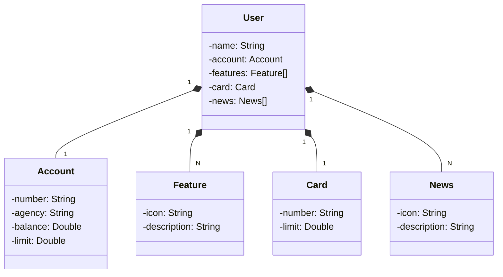

# Santander Dev Week 2023
Java RESTFul API created to Santander Dev Week

## Class Diagram

```mermaid
classDiagram
    class User {
        -name: String
        -account: Account
        -features: Feature[]
        -card: Card
        -news: News[]
    }

    class Account {
        -number: String
        -agency: String
        -balance: Double
        -limit: Double
    }

    class Feature {
        -icon: String
        -description: String
    }

    class Card {
        -number: String
        -limit: Double
    }

    class News {
        -icon: String
        -description: String
    }

    User "1" *-- "1"Account
    User "1"* -- "N" Feature
    User "1" *-- "1" Card
    User "1" *-- "N" News
```
